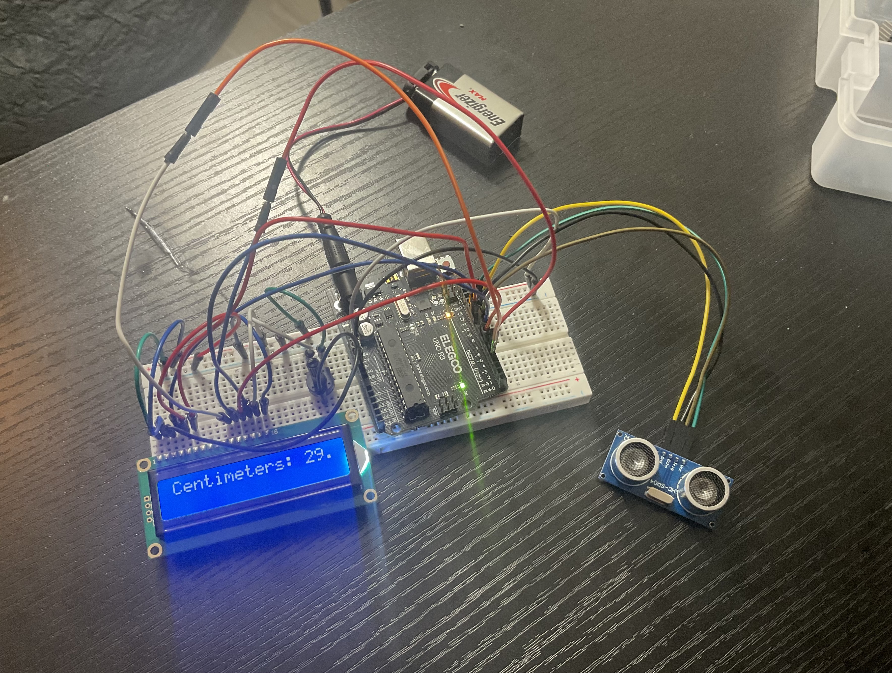
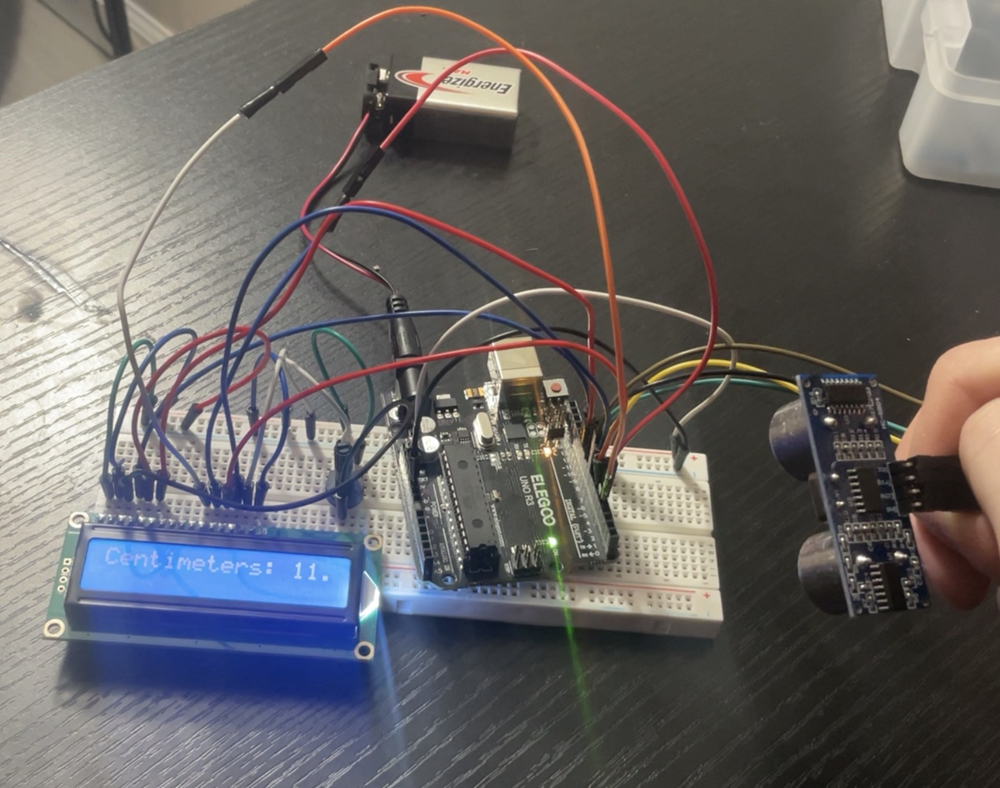

# Ultrasonic Distance Display

This is a small Arduino project that uses an HC-SR04 ultrasonic sensor to measure the distance to an object and displays the distance on a 16x2 LCD.
I built this project to learn how ultrasonic sensors actually measure distance and to get more experience connecting multiple components together. Instead of using an ultrasonic sensor library, the Arduino handles the trigger and echo timing directly.

## Hardware
- Arduino Uno
- HC-SR04 ultrasonic sensor
- 16x2 LCD
- Potentiometer
- Breadboard
- Jumper wires

## How It Works
The Arduino sends a 10 microsecond pulse to the trigger pin of the HC-SR04. The sensor then sends out an ultrasonic pulse and sets the echo pin HIGH while it waits for the reflected sound wave to return.
The Arduino uses `micros()` to measure how long the echo pin stays HIGH. Since the measured time includes the sound traveling to the object and back, the travel distance is divided by two to calculate the distance to the object.
The calculated distance is then continuously displayed on the LCD.

## Code
The Arduino code for the project will be added to this repository.

## Images

### Completed Circuit

### Distance Measurement Test

## What I Learned
- How the HC-SR04 measures distance using the time it takes for sound to bounce off an object and come back
- How to measure short time intervals using `micros()`
- How to control a 16x2 LCD with an Arduino
- How to connect multiple components to the same microcontroller
- How to debug incorrect sensor readings and data types
